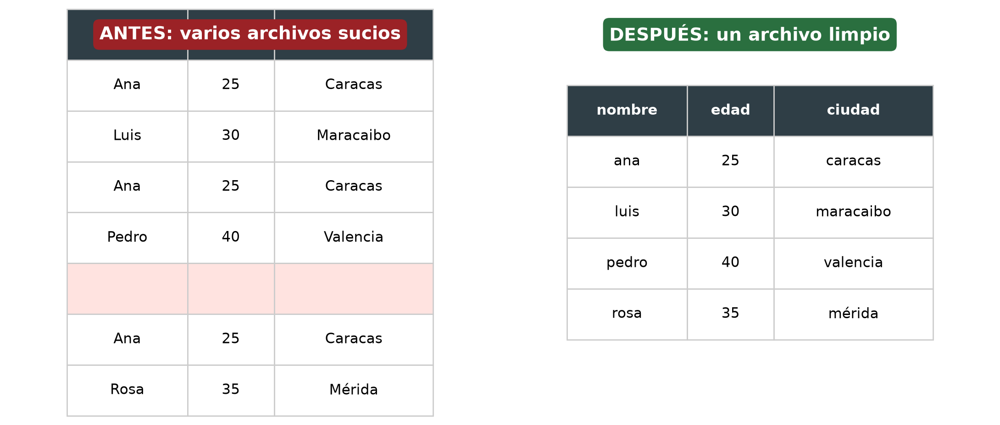

<div align="center">

# ⚔️ Sword

**Limpia y une archivos Excel en segundos.**

Deja de perder horas copiando y pegando celdas: Sword toma **todos** los Excel de una carpeta
y los entrega en **un solo archivo limpio y listo para usar**.

[](https://www.python.org/)
[](LICENSE)
[](https://github.com/hericsolorzano-beep/Sword/actions)
[](https://github.com/hericsolorzano-beep/Sword/releases/latest)
[]()
[]()
[]()

</div>

---

## 🧨 El problema que resuelve

Cada mes recibes los mismos datos **en muchas carpetas con formatos diferentes**:

```text
ventasENERO.xlsx     ventasFEBRERO.xlsx
┌────────┬─────┬──────────┐   ┌─────────┬──────┬─────────┐
│ Nombre │Edad │  Ciudad  │   │  Nombre │ Edad │ Ciudad  │
├────────┼─────┼──────────┤   ├─────────┼──────┼─────────┤
│ Ana    │ 25  │ Caracas  │   │  Pedro  │  40  │ Valencia│
│ Luis   │ 30  │Maracaibo │   │         │      │         │  ← fila vacía
│ Ana    │ 25  │ Caracas  │   │ Ana     │  25  │ Caracas │  ← duplicada
└────────┴─────┴──────────┘   │ Rosa    │  35  │  Mérida │
                              └─────────┴──────┴─────────┘
```

Con **un solo comando**, Sword entrega:

```text
resultado_limpio.xlsx
┌────────┬─────┬──────────┐
│ nombre │edad │  ciudad  │   ← encabezados normalizados
├────────┼─────┼──────────┤
│ ana    │ 25  │  caracas │   ← duplicados eliminados
│ luis   │ 30  │ maracaibo│
│ pedro  │ 40  │  valencia│   ← espacios limpiados
│ rosa   │ 35  │   mérida │
└────────┴─────┴──────────┘   ← filas vacías eliminadas
```

> ✅ Listo para abrir, mandar por correo o cargar en tu sistema.

<p align="center">
  
</p>

---

## ✨ Características

| | |
|---|---|
| 🗂️ **Une todos los Excel** de una carpeta (`.xlsx`, `.xls`, `.xlsm`) |
| 🚮 **Elimina filas duplicadas** (opción para conservarlas) |
| 🧹 **Quita filas vacías** y espacios sobrantes dentro de las celdas |
| 🏷️ **Normaliza encabezados**: `Nombre Cliente` → `nombre_cliente` |
| 📁 **Busca en subcarpetas** con `--recursivo` |
| 📄 **Exporta a Excel o CSV** (`.xlsx`, `.xls`, `.csv`) |
| 📊 **Resumen claro** de lo que hizo: archivos, filas, duplicados |
| 🖥️ **Funciona igual en Windows, Linux y macOS** |
| 🚀 **De cero a usarlo en 1 minuto** (instalador de un clic) |

---

## 🚀 Instalación

### 🪟 Windows — la forma fácil

**💾 ¿Quieres el ejecutable sin instalar nada?** Descarga **`Sword.exe`** desde
el [último Release](https://github.com/hericsolorzano-beep/Sword/releases/latest):
funciona en **cualquier Windows sin Python instalado**. Solo arranca y usa la
carpeta con tus Excel:

```bat
Sword.exe C:\Usuarios\TuNombre\Escritorio\mis_excels
```

1. **Cómo instalar Python** *(solo es la primera vez)*:
   - Descarga Python de <https://www.python.org/downloads/>
   - Al instalar, **marca la casilla "Add Python to PATH"** ✅

2. **Instala Sword de un clic**: descarga el proyecto (botón verde *Code* → *Download ZIP*),
   descomprime y **doble clic sobre `instalar_windows.bat`**. Espera a que termine.

3. **Úsalo**: doble clic sobre **`sword.bat`** (te pide la carpeta con los Excel)
   o abre una terminal:

   ```bat
   sword C:\Usuarios\TuNombre\Escritorio\mis_excels
   ```

> 💡 **¿No quieres instalar Python en el PC de tu cliente?** Ejecuta `compilar_exe.bat`
> una vez y obtienes **`dist\Sword.exe`**: un ejecutable único que **funciona en
> cualquier Windows sin Python instalado**.

### 🐧 Linux / macOS — la forma fácil

```bash
./instalar.sh
```

Listo. Después úsalo así:

```bash
.venv/bin/sword ~/Documentos/mis_excels
```

> 🛠️ **Atajo**: `export PATH="$HOME/.local/bin:$PATH"` y luego basta `sword ...`.

### 📦 Instalación por si te gusta Python

```bash
python -m venv .venv
source .venv/bin/activate        # en Windows: .venv\Scripts\activate
pip install -r requirements.txt
pip install -e .
sword --version
```

---

## 🎯 Uso

```bash
sword CARPETA_CON_EXCELS
```

Ejemplos:

| Comando | Qué hace |
|---|---|
| `sword ventas` | Une todos los Excel de `ventas` en `resultado_limpio.xlsx` |
| `sword ventas -o total.xlsx` | Guarda el resultado con otro nombre |
| `sword ventas -o datos.csv` | Exporta a CSV |
| `sword ventas -r` | Incluye archivos dentro de subcarpetas |
| `sword ventas --conservar-duplicados` | No borrar filas repetidas |
| `sword ventas --sin-limpiar` | Únirlos tal cual (sin limpieza) |
| `sword ventas --columnas-comunes` | Conserva solo las columnas que están en todos |
| `sword ventas -s "Hoja2"` | Lee una hoja concreta de cada archivo |
| `sword --version` | Muestra la versión |

### Ejemplo real

Dentro de la carpeta del proyecto hay una carpeta de prueba:

```bash
sword datos_prueba -v
```

```text
DEBUG Archivos encontrados: ['ventas_ene.xlsx', 'ventas_feb.xlsx']
DEBUG ventas_ene.xlsx       entrada=3 salida=3
DEBUG ventas_feb.xlsx       entrada=4 salida=3
                        Resumen
╭─────────────────┬──────────────────┬─────────────────╮
│ Archivo         │ Filas de entrada │ Filas de salida │
├─────────────────┼──────────────────┼─────────────────┤
│ ventas_ene.xlsx │                3 │               3 │
│ ventas_feb.xlsx │                4 │               3 │
│ TOTAL           │                7 │               4 │
╰─────────────────┴──────────────────┴─────────────────╯
✔ Listo! 2 archivo(s) unido(s) en resultado_limpio.xlsx (4 filas, 3 columnas).
  🗑  2 fila(s) duplicada(s) eliminada(s)
  🧹 1 fila(s) vacía(s) eliminada(s)
```

---

## 🆘 Solución de problemas

| Problema | Solución |
|---|---|
| **"No se encontró Python"** | Marca *"Add Python to PATH"* al instalar Python y reinicia |
| **"No se encontraron archivos Excel"** | Revisa que la carpeta tenga `.xlsx`/`.xls` y estés apuntando a la correcta |
| **Resultado sin filas** | Revisa que la hoja correcta tenga datos (`-s "NombreHoja"` para elegir hoja) |
| **No lee archivos `.xls` viejos** | Asegúrate de que sea un `.xls` real de Excel (no un CSV renombrado) |
| **El programa no responde** | Control + C lo detiene de forma segura |
| **Puedo usarlo con mis propios datos?** | Sí, siempre crea una copia de tus originales primero |

---

## 🔧 Desarrollo y pruebas

```bash
make test        # o: pytest
make demo        # regenera el ejemplo de salida
```

Sword viene con pruebas automatizadas que se ejecutan en **Windows y Linux**
(cada *push* a GitHub corriendo también en macOS/Linux) para que siempre
funcione igual en todas las plataformas.

---

## 💼 ¿Te serviría una automatización a medida?

Este proyecto es una muestra de lo que puedo hacer: herramientas sencillas que
le ahorran **horas cada mes** a personas y negocios.

- 🧹 Limpieza y unión de archivos Excel
- 📝 Llenado automático de formularios
- 🌐 Extracción de datos de la web
- 📊 Reportes automáticos

> *"No automatizo por automatizar: automatizo para que tengas más tiempo para
> lo importante."*

**Autor:** Heric — disponible para proyectos freelance.
📬 <https://github.com/hericsolorzano-beep>

---

## 📄 Licencia

MIT License — ver [LICENSE](LICENSE).