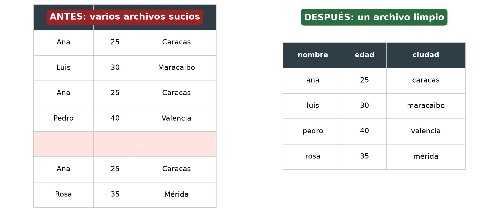

<div align="center">

# ⚔️ Sword

**Limpia y une archivos Excel en segundos.**

Deja de perder horas copiando y pegando celdas: Sword toma **todos** los Excel de una carpeta
y los entrega en **un solo archivo limpio y listo para usar**.

[](https://www.python.org/)
[](https://github.com/hericsolorzano-beep/Sword/actions/workflows/ci.yml)
[](https://github.com/hericsolorzano-beep/Sword/actions/workflows/ci.yml)
[](https://mypy-lang.org/)
[](https://docs.astral.sh/ruff/)
[](LICENSE)
[](https://github.com/hericsolorzano-beep/Sword/releases/latest)

[⬇️ Descargar Sword](https://github.com/hericsolorzano-beep/Sword/releases/latest) · [🐛 Reportar un error](https://github.com/hericsolorzano-beep/Sword/issues) · [🤝 Contribuir](CONTRIBUTING.md)

</div>

---

## 🧨 El problema que resuelve

Cada mes recibes los mismos datos **en muchas carpetas con formatos diferentes**:

```text
ventasENERO.xlsx     ventasFEBRERO.xlsx
┌────────┬─────┬──────────┐   ┌─────────┬──────┬─────────┐
│ Nombre │Edad │  Ciudad  │   │  Nombre │ Edad │ Ciudad  │
├────────┼─────┼──────────┤   ├─────────┼──────┼─────────┤
│ Ana    │ 25  │ Caracas  │   │  Pedro  │  40  │ Valencia│
│ Luis   │ 30  │Maracaibo │   │         │      │         │  ← fila vacía
│ Ana    │ 25  │ Caracas  │   │ Ana     │  25  │ Caracas │  ← duplicada
└────────┴─────┴──────────┘   │ Rosa    │  35  │  Mérida │
                              └─────────┴──────┴─────────┘
```

Con **un solo comando**, Sword entrega:

```text
resultado_limpio.xlsx
┌────────┬─────┬──────────┐
│ nombre │edad │  ciudad  │   ← encabezados normalizados
├────────┼─────┼──────────┤
│ ana    │ 25  │  caracas │   ← duplicados eliminados
│ luis   │ 30  │ maracaibo│
│ pedro  │ 40  │  valencia│   ← espacios limpiados
│ rosa   │ 35  │   mérida │
└────────┴─────┴──────────┘   ← filas vacías eliminadas
```

> ✅ Listo para abrir, mandar por correo o cargar en tu sistema.

<p align="center">
  
</p>

---

## ✨ Qué hace

| | |
|---|---|
| 🗂️ **Une todos los Excel** de una carpeta: lee `.xlsx`, `.xls` y `.xlsm` |
| 🚮 **Elimina filas duplicadas** (o conserva las que quieras con una opción) |
| 🧹 **Quita filas vacías** y espacios sobrantes dentro de las celdas |
| 🏷️ **Normaliza encabezados**: `Nombre Cliente` → `nombre_cliente` |
| 📁 **Busca en subcarpetas** con `--recursivo` |
| 📄 **Exporta a `.xlsx` o `.csv`** |
| 🔁 **Es idempotente**: puedes volver a ejecutarlo sin que se contamine |
| 🖥️ **Probado en Windows, Linux y macOS**, en Python 3.10 a 3.13 |
| 🚀 **De cero a usarlo en 1 minuto** |

---

## 🚀 Instalación

### 🪟 Sin instalar nada

**💾 Descarga el binario** desde el
[último Release](https://github.com/hericsolorzano-beep/Sword/releases/latest).
**Ningún ejecutable necesita Python instalado.**

| Sistema | Archivo | Cómo usarlo |
|---|---|---|
| Windows | `Sword.exe` | doble clic, o `Sword.exe CARPETA` |
| macOS | `Sword` | `chmod +x Sword` y luego `./Sword CARPETA` |
| Linux | `Sword` | `chmod +x Sword` y luego `./Sword CARPETA` |

> La **v1.0.0** solo traía el binario de Windows. Desde la v1.1.0 el proceso de
> publicación compila y verifica los tres sistemas, así que la
> [página de releases](https://github.com/hericsolorzano-beep/Sword/releases/latest)
> es la fuente de verdad sobre qué hay disponible ahora mismo.

En Windows también puedes arrastrar la carpeta con tus Excel encima del
ejecutable.

### 🐧 Instalador para Linux y macOS

```bash
git clone https://github.com/hericsolorzano-beep/Sword
cd Sword
./instalar.sh
```

### 🪟 Instalador de un clic para Windows

1. Instala Python desde <https://www.python.org/downloads/> y **marca
   *"Add Python to PATH"*** ✅ *(solo la primera vez)*.
2. Descarga el proyecto (*Code* → *Download ZIP*) y descomprime.
3. **Doble clic en `instalar_windows.bat`** y espera a que termine.

### 🐍 Con Python

```bash
python -m venv .venv
source .venv/bin/activate          # en Windows: .venv\Scripts\activate
pip install -e .
sword --version
```

---

## 🎯 Uso

```bash
sword CARPETA_CON_EXCELS
```

| Comando | Qué hace |
|---|---|
| `sword ventas` | Une todos los Excel de `ventas` en `resultado_limpio.xlsx` |
| `sword ventas -o total.xlsx` | Guarda el resultado con otro nombre |
| `sword ventas -o datos.csv` | Exporta a CSV (con `utf-8-sig`, lo abre Excel sin pasos extra) |
| `sword ventas -r` | Incluye archivos dentro de subcarpetas |
| `sword ventas --conservar-duplicados` | No borrar filas repetidas |
| `sword ventas --sin-limpiar` | Únirlos tal cual (sin limpieza) |
| `sword ventas --columnas-comunes` | Conserva solo las columnas que están en todos, en el orden del primer archivo |
| `sword ventas -s "Hoja2"` | Lee una hoja concreta de cada archivo |
| `sword ventas -v` | Detalle de cada archivo (útil para depurar) |
| `sword --version` | Muestra la versión |

### Ejemplo real

```bash
sword datos_prueba -v
```

```text
DEBUG Archivos encontrados: ['ventas_ene.xlsx', 'ventas_feb.xlsx']
DEBUG ventas_ene.xlsx       entrada=3 salida=3
DEBUG ventas_feb.xlsx       entrada=4 salida=3
                         Resumen
╭─────────────────┬──────────────────┬─────────────────╮
│ Archivo         │ Filas de entrada │ Filas de salida │
├─────────────────┼──────────────────┼─────────────────┤
│ ventas_ene.xlsx │                3 │               3 │
│ ventas_feb.xlsx │                4 │               3 │
│ TOTAL           │                7 │               4 │
╰─────────────────┴──────────────────┴─────────────────╯
✔ Listo! 2 archivo(s) unido(s) en resultado_limpio.xlsx (4 filas, 3 columnas).
  🗑  2 fila(s) duplicada(s) eliminada(s)
  🧹 1 fila(s) vacía(s) eliminada(s)
```

### Sword también es una librería

El núcleo no depende de la consola, así que puedes llamarlo desde otro script:

```python
from pathlib import Path
from sword.core import unir

resumen = unir(Path("ventas"), Path("total.xlsx"))
print(resumen.archivos, resumen.filas_salida, resumen.duplicados_eliminados)
```

---

## 🔧 Cómo está construido

Un proyecto pequeño, pero con las prácticas que se esperan de software que
alguien más va a mantener:

| | |
|---|---|
| 🧱 **Núcleo y consola separados** | `sword/core.py` no sabe nada de `argparse` ni de la terminal, y se puede usar como librería. `sword/cli.py` solo traduce argumentos y formatea la salida. |
| 🧪 **39 pruebas automatizadas** | Cubren el camino feliz, los datos sucios, los errores y los límites. Cobertura del **93 %**, con un mínimo del 85 % exigido en la CI. |
| ✅ **Integración continua** | Cada *push* corre las pruebas en **Windows, Linux y macOS** y en **Python 3.10 a 3.13**. Si algo se rompe, se ve en el pull request, no en el cliente. |
| 🔍 **Linter y tipos** | `ruff` y `mypy` limpios, configurados en `pyproject.toml` y exigidos en la CI. |
| 🚪 **Errores que se pueden leer** | El cliente final nunca ve un *traceback*: recibe una frase que dice qué hacer. Con `-v` sí se obtiene el detalle técnico. |
| 📦 **Instalable y publicable** | `pyproject.toml` con la versión declarada en un solo sitio, y binarios para los tres sistemas generados y verificados automáticamente en cada release. |
| 🔒 **Sin red** | Sword no hace ninguna llamada a internet. Tus datos no salen del equipo. |

### Estructura

```text
sword/
├── core.py          # leer, limpiar y unir (sin dependencias de la consola)
├── cli.py           # argumentos, salida formateada y códigos de salida
└── __main__.py      # permite `python -m sword`
tests/               # 39 pruebas, incluidas las de regresión de cada bug
.github/workflows/  # CI (pruebas + lint + tipos) y release de binarios
```

### Desarrollo

```bash
make install     # entorno + herramientas
make check       # lo mismo que corre la CI: test + lint + tipos
make test        # solo pruebas, con cobertura
make demo        # regenera la salida de ejemplo
```

Los cambios siguen [Conventional Commits](CONTRIBUTING.md) y cada corrección de
bug trae su prueba de regresión. El historial de cambios está en
[CHANGELOG.md](CHANGELOG.md).

---

## ⚠️ Límites conocidos

Por transparencia, esto es lo que Sword **no** hace:

- **No escribe `.xls`** (el formato antiguo de Excel). Sí los **lee**, pero si
  le pides guardar en `.xls` te avisa y te sugiere `.xlsx` o `.csv`. Antes
  escribía un archivo con extensión mentirosa; ahora lo dice.
- **No sabe qué dos columnas son "la misma" con distinto nombre.** Si un mes
  la columna se llama `Edad` y al otro `EDAD_PERSONA`, Sword las une como dos
  columnas distintas. Para eso está `--conservar-columnas` y, si hace falta,
  normalizar a mano antes.
- **No lee archivos cifrados ni con contraseña.**
- **No programa nada:** no deja tareas automáticas en el sistema. Eso lo pones
  tú con el programador de tareas de Windows o con `cron`.
- La salida por defecto se llama `resultado_limpio.xlsx` y se escribe en la
  carpeta de trabajo. **Tus archivos originales nunca se tocan**, pero conviene
  no guardarlos con ese mismo nombre.

---

## 🆘 Solución de problemas

| Problema | Solución |
|---|---|
| **"No se encontró Python"** (instalador Windows) | Reinstala Python marcando *"Add Python to PATH"* y reinicia la terminal |
| **"No se encontraron archivos Excel"** | Revisa que la carpeta tenga `.xlsx`/`.xls` y que estés apuntando a la correcta |
| **"No se puede guardar en .xls"** | Es a propósito: guarda como `.xlsx` o `.csv`, que abren todos los Excel |
| **Resultado sin filas** | Revisa que la hoja correcta tenga datos: `-s "NombreHoja"` elige hoja |
| **Columnas que no se unifican** | Sus encabezados difieren entre archivos. Revísalos o usa `--conservar-columnas` |
| **No lee archivos `.xls` viejos** | Debe ser un `.xls` real de Excel, no un CSV renombrado |
| **El programa no responde** | `Control + C` lo detiene de forma segura |
| **Sale "Permiso denegado" en Linux/macOS** | El binario perdió el permiso de ejecución: `chmod +x Sword` |

---

## 💼 ¿Te serviría una automatización a medida?

Este proyecto es una muestra de lo que puedo hacer: herramientas sencillas que
le ahorran **horas cada mes** a personas y negocios.

- 🧹 Limpieza y unión de archivos Excel
- 📝 Llenado automático de formularios
- 🌐 Extracción de datos de la web
- 📊 Reportes automáticos

> *"No automatizo por automatizar: automatizo para que tengas más tiempo para
> lo importante."*

**Autor:** Heric Solorzano — disponible para proyectos freelance.
📬 <https://github.com/hericsolorzano-beep>

---

## 📄 Licencia

MIT License — ver [LICENSE](LICENSE).
